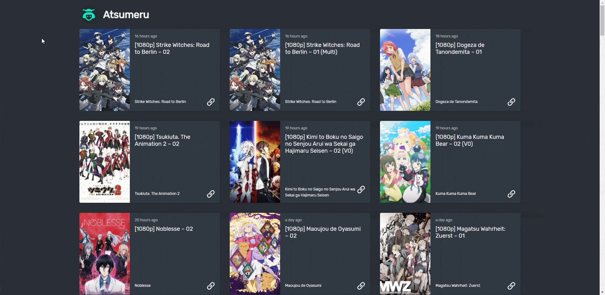

# Atsumeru-Deluge

Quickly add torrents to Deluge.

[](./art/demo.gif)

## Usage

Create a `.env` file based on `.env.sample`

```
cp .env.sample .env
```

Install dependencies

```
yarn install
```

Start

```
yarn start
```

http://localhost:3000
